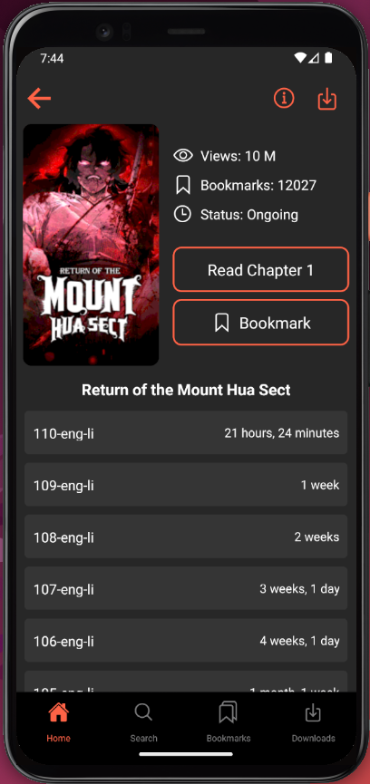
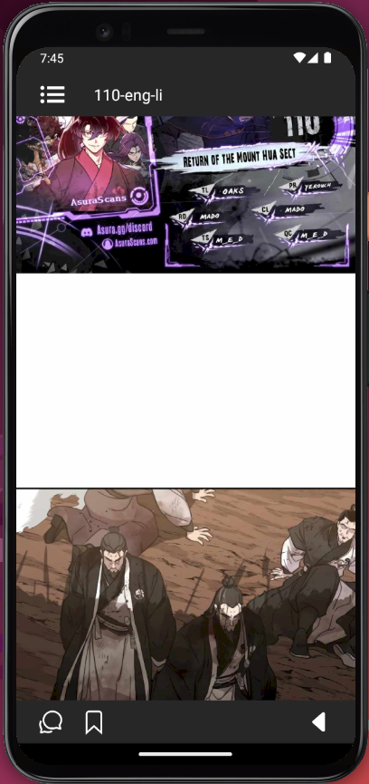

# Webtoon Reader

This application is still under development, soon available on playstore & appstore 💻

## 🤔 What is this ?

This project is a full stack mobile application to read webtoons. The current most popular webtoon reading application ([WEBTOON](https://www.webtoons.com/en/)) is missing a lot of famous webtoons. Therefore I decided to create my own in order to fetch webtoons myself from different websites that do not have a mobile application, increasing the choice for the users.

## ⚙️ Tech Stack
<u>Front end</u>: [React Native](https://reactnative.dev/), [Typescript](https://www.typescriptlang.org/)

<u>Back end</u>: [Node.js](https://nodejs.org/en), [MongoDB](https://www.mongodb.com/fr-fr)

## 💡 Technical Challenges Encountered

The chapter images are high resolution images with unsual dimensions (8000x1000). Fetching them and displaying them as fast as possible so that the user doesn't disconnect from the story he's reading is a crutial requirement. Being myself a webtoon adept, there's nothing more frustrating than scrolling and seeing the images flash as they load during an epic scene. 

I tried implementing the image list (one chapter is composed of 10 to 50 images based on the length) in various ways, trying combinations of [Image](https://reactnative.dev/docs/image), [Fast Image](https://github.com/DylanVann/react-native-fast-image), [Flat Lists](https://reactnative.dev/docs/flatlist), [Flash Lists](https://shopify.github.io/flash-list/)... to only name the main ones. In the end the best option is definitely not the one you would expect. The best option, giving us a fast download, high frame rate, optimized image caching, seem-less image transitioning, was to create a local html page with the images inside and then to display it using the [Webview](https://www.npmjs.com/package/react-native-webview) component, therefore utilizing the native Webview optimizations.

## Home Screen

## Chapter Details Screen

## Download Screen

## Downloaded Webtoons Screen

## Chapter Reading Screen

